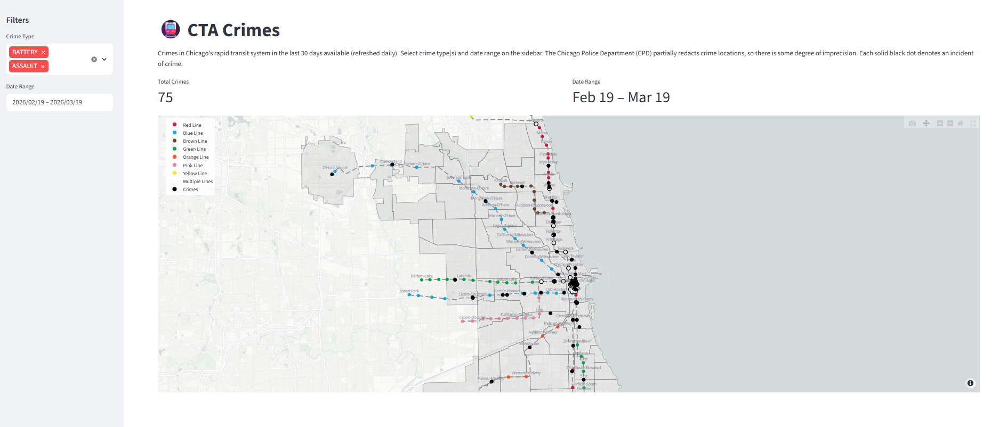

# Chicago Transit Crimes Tracker

This is a simple dashboard to visualize crimes in Chicago's rapid transit system. covering over 200 miles of track across Chicagoland. The data originates from the Chicago Data Portal via the Socrata API, refreshed daily for the last 30 days available.

## Requirements
1. Python >= 3.8 (minimum version for `uv`, a Python package manager)
2. Socrata API

## Instructions (Development)
1. Generate API key and app token for Socrata API through https://evergreen.data.socrata.com/. See Developer Settings after creating an account. Set your API Key ID, API Key Secret, and App Token in `./streamlit/secrets.toml` as `socrata_username`, `socrata_password`, and `socrata_app_token`, respectively.
2. Do `pip install uv` (if needed), then `uv sync` from this project's root directory.
3. Do `uv run streamlit run ./app.py`.

## Instructions (Production)
View the dashboard at https://chicagotransitcrime.streamlit.app/:

